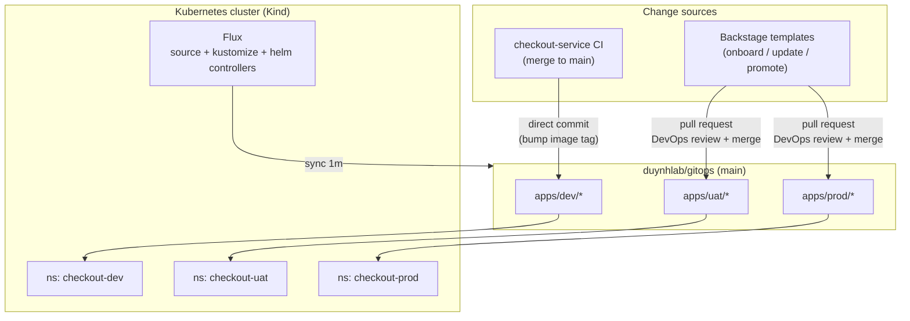
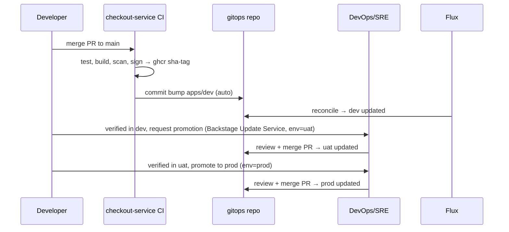

# gitops

GitOps repository for the duynhlab platform — the single source of truth for
what runs in every environment. Owned by **DevOps/SRE** (CODEOWNERS); developers
never push here directly. Changes arrive as pull requests from
[Backstage self-service templates](https://github.com/duynhlab/backstage) or
from service CI (dev auto-deploy).

## Architecture



## Promotion flow



## Layout

```
clusters/kind/            # Flux entrypoint (FluxInstance syncs this path)
├── sources.yaml          # OCIRepository: shared mop Helm chart
├── apps-dev.yaml         # Kustomization → ./apps/dev
├── apps-uat.yaml         # Kustomization → ./apps/uat
└── apps-prod.yaml        # Kustomization → ./apps/prod

apps/
├── base/<service>/       # Environment-invariant HelmRelease (chart, probes, resources)
└── <env>/<service>/      # namespace + kustomization + release-patch.yaml
                          # (replicas, image tag, FULL env var list — source of truth per env)

catalog/<service>.yaml    # Backstage catalog entity (discovered, never applied by Flux)
```

Design notes:

- **Per-env `release-patch.yaml` is the full desired state** of a service in that
  environment: image tag, replicas and the complete env var contract
  (`SERVICE_NAME`, `ENV`, `LOG_LEVEL`, `OTEL_*`, `SHUTDOWN_TIMEOUT`, …).
  Diffs stay small and reviews are self-contained.
- **`apps/base`** holds what never differs per environment (chart ref, probes,
  resources, service ports).
- **`catalog/`** sits outside every Flux sync path, so Backstage entities are
  never applied to the cluster; Backstage's GitHub provider discovers them.
- Environments map to namespaces on one Kind cluster today
  (`checkout-dev/uat/prod`). Moving to real per-env clusters only requires
  pointing each cluster's FluxInstance at its own `clusters/<name>` path.

## Environments

| Env | Namespace | Update path | ENV | LOG_LEVEL | Replicas |
|-----|-----------|-------------|-----|-----------|----------|
| dev | checkout-dev | CI auto-commit on every main build | development | debug | 1 |
| uat | checkout-uat | Backstage PR + DevOps review | staging | info | 2 |
| prod | checkout-prod | Backstage PR + DevOps review | production | warn | 2 |

## Guard rails

- `CODEOWNERS`: DevOps/SRE review required on every PR
- Branch protection on `main`: 1 approving review; admins (DevOps + the CI
  deploy token) can bypass for the dev auto-deploy lane
- Images are immutable (`sha-<short>` / semver) — promotion means moving a tag
  through env files, never rebuilding
